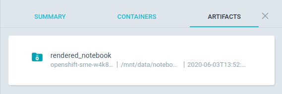

# Automating notebooks A-Z

This repo is being automated. This document outlines the principles on which this specific automation is based and hopes to serve as a guide for future, similar use cases.

## Reasoning

The main purpose of this repository is to provide and document the analysis process for a specific use case. It does so via analysis notebooks which operate over a continuous stream of data. To receive a fresh results it is required that the notebooks are rerun every time new data becomes available. This fact alone presents a great opportunity for automation. And since the analysis is already broken into Jupyter notebooks, where each specific notebook has a distinct role in the process, it is even more well suited for automation.

## Notebooks

The notebooks are structured in such a way that each is expected to perform a specific and distinct function. As a byproduct, this also defines the flow of tasks, a clear path which the analyst, user or the automation is expected to follow. We consider as an anti-pattern the practise of cross-linking notebooks from the middle of another notebook. Notebooks have to be executable as a whole, without interruption, with the only exception being where one is dependant on another. In that case, once the prerequisite notebooks are run, the notebook, again, has to be executable as a whole. In other words, the notebook dependencies have to be resolved before the notebook execution starts.

### Folder strucuture

For organization purposes we broke the `notebooks` folder in this repo into 3 different folders. This organization doesn't effect the automation in any way. It's present only for the purposes of developer and analyst orientation in the repo and making the notebook flow more obvious.

- `01_collect_data` - The purpose of notebooks in this folder is to gradually prepare the datasets which are required for the analysis. These notebooks respect a common runtime layout, an API if you will, that defines where to store data, what data should be downloaded and under what circumstances. Especially, when a notebook is run in automation, we don't want to process all the historical data again, we prefer to process only the incremental addition to the dataset and reuse the rest of the dataset chunks from previous runs. On the other hand, when the notebooks are run in a standalone environment for exploration purposes - like in a JupyterHub for example, we want the notebooks to be usable as well. And we can't expect the data scientist or any other third party to have access to our preprocessed data. In such cases we want to retain the ability to process the dataset as a whole.
- `02_analyses` - Notebooks in this folder are meant to analyse one or more datasets and provide some findings. Here, the actual results of the data scientist's works are documented and presented. Each notebook in this folder can be run separately and doesn't depend on any other notebook here. In automation we expect all notebooks in this folder to be run in parallel and independently.
- `experimental` - Notebooks that are not expected to be executed during the automated runs. They are left here for experimentation and analyst curiosity.

### Data exchange protocol

Let's imagine a scenario: A data analysts, working in JupyterHub opens a notebook. He works on that notebook and wants to store the results in the JupyterHub instance. He does that because later he may want to reuse these findings in another notebook. Once he opens this hypothetical second notebook, he expects he can load the data here by using the very same path he used before to store it. This is a common way of exchanging data when creating analysis. However, it creates a dependency between notebooks that has to be respected.

Now let's say we want to replicate the very same scenario in automation. The trouble is that in automation each notebook is executed as a separate container. And that requires us to use a different approach - it can be either a remote storage, a shared volume or any other imaginable solution. There are many. We chose to mount a shared volume to all the containers since it's the most simplistic approach that behaves the same as local storage would.

Our goal is to make this process work the exact same way regardless of if the notebook is opened in JupyterHub or run as a container. To do so, we need to enforce some basic rules to make it happen. We use the following pattern:

Each notebook dealing with locally stored data is expected to check the `LOCAL_DATA_PATH` environment variable. This is a mandatory path used as a base path for any local data storage. If this variable is not set in the environment, the notebook is expected to use the `data` folder in the repository root (specified as a relative path to that notebook's working directory). In automation the `LOCAL_DATA_PATH` matches a mount point of a shared volume.

This ensures a common pattern is maintained across all notebooks that would like to access local data. For example, a notebook accessing local data under `f'{LOCAL_DATA_PATH}/subfolder/dataset.csv'` results in:

1. When executed in JupyterHub, this resolves to `data/subfolder/dataset.csv`
2. In an automation environment this translates to `/shared_folder_mount_point/subfolder/dataset.csv`

### Automation specific behavior

There are places in the notebook, where we want to differentiate the behavior, based on the environment in which the notebook is being executed. For instance, when it comes to publishing the analysis results. We want to be able to execute all the notebook's cells in JupyterHub but we may not want to touch the data we publish to consumers. Or we may want to collect all the datasets from scratch in JupyterHub, while in automation we want to reuse our previously populated dataset chunks.

To achieve this we introduce a flag, an environment variable `RUN_IN_AUTOMATION` which is present in the automated environment only:

```python
import os

if os.getenv('RUN_IN_AUTOMATION'):
    # Run as automated notebook
else:
    # Run in JupyterHub
```

We also introduce a couple of utility functions that help to decide (again, based on the execution environment) what range of data we're working with. See `src/utils.py` for details. These functions allows us to use the same code with different results based on the environment, eg:

```python
# in Automation
get_months() == [<PREVIOUS_MONTH_NUMBER>]
# in JupyterHub
get_months() == range(1,13)
```

## Automation etiquette

When executing notebooks in automation we don't want to collect and rebuild all the datasets from scratch. Instead, we should focus on the new data only. Therefore we changed how our datasets are stored and loaded. Since we perform our analysis monthly and our data is partitioned by months, we respect this scheme and store the datasets in monthly increments.

We also don't store the raw data, instead we only store the preprocessed datasets. The new chunk of data is always uploaded to the general shared location in Ceph, where it is retained and available to be downloaded by the next run. To facilitate this job, we implement a notebook that collects the dataset chunks from Ceph - see `01_collect_data/download_datasets.ipynb`, this notebook is run in parallel to all other dataset preprocessing tasks. For the individual run purposes, all the chunks are stored on a shared volume where all our analysis tasks have access to it.

And again, since the dataset is stored in multiple files, we need to simplify the loading mechanism for the notebooks - there's a `load_dataset` function in the `src/utils.py` file for this purpose.

## Container image

The next aspect of automating an analytics repository with notebooks is to make an image out of it. We use [S2I](https://github.com/openshift/source-to-image) to facilitate that. We treat the repository as a regular Python project, so we expect a `Pipfile` that lists all the requirements of the notebooks. Notebooks can't install any libraries in runtime, everything has to be baked into the image.

Additionally we require the repository to feature a few additional dependencies:

- `nbconvert` - Executes the notebooks
- `jupyter` - Provides the execution runtime

Since the packages mentioned above are executing the image for us, they can't be left as is and need to be properly configured. To do that we provide a `nbcovert` configuration file in `.jupyter` folder, that adjusts all the important settings, namely:

- `c.ExecutePreprocessor.enabled = True` instructs the `nbcovert` to execute the notebook.
- `c.ExecutePreprocessor.timeout = 1200` defines a maximum time for a cell to be left in pending state (1200s in this particular case, should be fitted to your usecase). If the cell takes longer to execute, the runtime raises an exception and marks the task as failed.
- `c.ExecutePreprocessor.kernel_name = 'python3` sets the Jupyter's `kernel_name` to the one present in the image. This overrides kernel settings in the notebook's metadata.

As well as others that later facilitate debugging and storing of the rendered notebook.

## Argo workflow

The crucial and final part of the automation process is to define a workflow. As we described in the previous section, we use [`nbcovnert`](https://nbconvert.readthedocs.io/) to execute the notebooks. As part of the Argo workflow we define this as a task template that we later refer to in our actual execution tasks:

```yaml
...
spec:
  ...
  templates:
    ...
    - name: notebook-executor
      inputs:
        parameters:
          - name: notebook
      outputs:
        artifacts:
          - name: rendered_notebook
            ...
      container:
        image: <IMAGE_NAME>:latest
        command: [jupyter-nbconvert]
        args:
          - --config
          - .jupyter/jupyter_nbconvert_config.py
          - "notebooks/{{inputs.parameters.notebook}}"
        env:
          ...
        volumeMounts:
          ...
```

As you can see, the task template defines a single `input` parameter - the notebook which is executed as a relative path within the `notebooks` folder. This parameter is later used in the `args` section for the `nbcovert` command. The arguments here simply instructs it to load the configuration file and points to the notebook.

This task template also sets all the environment variables we may need, the volume mounts, etc. You can also see this template has an `outputs` section, since we are collecting the rendered notebooks as well (with some help from a specific configuration in the `nbcovert`'s output path).

Later on, we just define the tasks (notebooks) order in which we want to execute them. We orchestrate those tasks the same way as we would any Argo workload, using [`steps`](https://argoproj.github.io/docs/argo/examples/readme.html#steps) or [`dag`](https://argoproj.github.io/docs/argo/examples/readme.html#dag), etc. Additionally, we can use more advanced Argo features here like the [retry strategy](https://argoproj.github.io/docs/argo/examples/readme.html#retrying-failed-or-errored-steps) or others. Here's an example of a single task using the template defined above.

```yaml
...
spec:
  ...
  templates:
    ...
    - name: analysis
      steps:
        - - name: contributor-analysis
            template: notebook-executor
            arguments:
              parameters: [{name: notebook, value: 02_analyses/contributor_analysis.ipynb}]
        ...
```

As you can see, extending the workflow with a tasks to run a new analysis is fairly straightforward, all it takes are those 4 lines.

If you drill down into our Argo setup you may discover more fine details, like the rendered notebook collection mechanisms or dataset collection task graph.

## Result

In our case the resulting workflow, when executed, looks like this:


Each task stores the rendered notebook as an artifact:



And since it's Argo, it can provide a quite detailed insight into the tasks, like a timeline drilldown:


Or a CLI drilldown:

```shell
$ argo get openshift-sme-w4k8x
Name:                openshift-sme-w4k8x
Namespace:           sme
ServiceAccount:      default
Status:              Succeeded
Created:             Wed Jun 03 15:51:29 +0200 (1 day ago)
Started:             Wed Jun 03 15:51:29 +0200 (1 day ago)
Finished:            Wed Jun 03 16:02:55 +0200 (1 day ago)
Duration:            11 minutes 26 seconds

STEP                                      TEMPLATE           PODNAME                         DURATION  MESSAGE
 ✔ openshift-sme-w4k8x                    entrypoint
 ├---✔ data-collection                    data-collection
 |   ├-✔ collect-raw-data                 notebook-executor  openshift-sme-w4k8x-2809256371  24s
 |   ├-✔ download-dataset                 notebook-executor  openshift-sme-w4k8x-1768341034  11s
 |   ├-✔ parse-raw-to-metadata-dataset    notebook-executor  openshift-sme-w4k8x-2638318032  39s
 |   ├-✔ parse-raw-to-text-dataset        notebook-executor  openshift-sme-w4k8x-1075735382  55s
 |   └-✔ parse-text-to-tokenized-dataset  notebook-executor  openshift-sme-w4k8x-2003291399  4m
 └---✔ analysis                           analysis
     └-·-✔ contributor-analysis           notebook-executor  openshift-sme-w4k8x-4112645755  54s
       ├-✔ environment-analysis           notebook-executor  openshift-sme-w4k8x-270518635   5m
       ├-✔ functional-category-analysis   notebook-executor  openshift-sme-w4k8x-1297678100  2m
       └-✔ version-analysis               notebook-executor  openshift-sme-w4k8x-2725248436  48s
```

It also allows you to see what happened during the notebooks execution step since each of the tasks logs the data in a logstash-able format:

```json
{"@timestamp": "2020-06-03T13:51:34", "@version": 1, "level": "INFO", "name": "NbConvertApp", "message": "Converting notebook notebooks/01_collect_data/download_datasets.ipynb to notebook"}
{"@timestamp": "2020-06-03T13:51:34", "@version": 1, "level": "DEBUG", "name": "NbConvertApp", "message": "Notebook name is 'download_datasets'"}
{"@timestamp": "2020-06-03T13:51:34", "@version": 1, "level": "DEBUG", "name": "NbConvertApp", "message": "Applying preprocessor: ExecutePreprocessor"}
{"@timestamp": "2020-06-03T13:51:35", "@version": 1, "level": "DEBUG", "name": "NbConvertApp", "message": "Starting kernel: ['/opt/app-root/bin/python3.6', '-m', 'ipykernel_launcher', '-f', '/tmp/tmpoqbbj5t9.json', '--HistoryManager.hist_file=:memory:']"}
{"@timestamp": "2020-06-03T13:51:35", "@version": 1, "level": "DEBUG", "name": "NbConvertApp", "message": "Connecting to: tcp://127.0.0.1:50380"}
{"@timestamp": "2020-06-03T13:51:35", "@version": 1, "level": "DEBUG", "name": "NbConvertApp", "message": "connecting shell channel to tcp://127.0.0.1:40592"}
{"@timestamp": "2020-06-03T13:51:35", "@version": 1, "level": "DEBUG", "name": "NbConvertApp", "message": "Connecting to: tcp://127.0.0.1:40592"}
{"@timestamp": "2020-06-03T13:51:35", "@version": 1, "level": "DEBUG", "name": "NbConvertApp", "message": "connecting iopub channel to tcp://127.0.0.1:48929"}
{"@timestamp": "2020-06-03T13:51:35", "@version": 1, "level": "DEBUG", "name": "NbConvertApp", "message": "Connecting to: tcp://127.0.0.1:48929"}
{"@timestamp": "2020-06-03T13:51:35", "@version": 1, "level": "DEBUG", "name": "NbConvertApp", "message": "connecting stdin channel to tcp://127.0.0.1:58237"}
{"@timestamp": "2020-06-03T13:51:35", "@version": 1, "level": "DEBUG", "name": "NbConvertApp", "message": "Connecting to: tcp://127.0.0.1:58237"}
{"@timestamp": "2020-06-03T13:51:35", "@version": 1, "level": "DEBUG", "name": "NbConvertApp", "message": "connecting heartbeat channel to tcp://127.0.0.1:42218"}
{"@timestamp": "2020-06-03T13:51:35", "@version": 1, "level": "DEBUG", "name": "NbConvertApp", "message": "connecting control channel to tcp://127.0.0.1:50380"}
{"@timestamp": "2020-06-03T13:51:35", "@version": 1, "level": "DEBUG", "name": "NbConvertApp", "message": "Connecting to: tcp://127.0.0.1:50380"}
{"@timestamp": "2020-06-03T13:51:36", "@version": 1, "level": "INFO", "name": "NbConvertApp", "message": "Executing notebook with kernel: python3"}
{"@timestamp": "2020-06-03T13:51:36", "@version": 1, "level": "DEBUG", "name": "NbConvertApp", "message": "Executing cell:
import os
from pathlib import Path
import boto3
from concurrent import futures"}
{"@timestamp": "2020-06-03T13:51:36", "@version": 1, "level": "DEBUG", "name": "NbConvertApp", "message": "msg_type: status"}
{"@timestamp": "2020-06-03T13:51:36", "@version": 1, "level": "DEBUG", "name": "NbConvertApp", "message": "content: {'execution_state': 'busy'}"}
{"@timestamp": "2020-06-03T13:51:36", "@version": 1, "level": "DEBUG", "name": "NbConvertApp", "message": "msg_type: execute_input"}
{"@timestamp": "2020-06-03T13:51:36", "@version": 1, "level": "DEBUG", "name": "NbConvertApp", "message": "content: {'code': 'import os\nfrom pathlib import Path\nimport boto3\nfrom concurrent import futures', 'execution_count': 1}"}
{"@timestamp": "2020-06-03T13:51:36", "@version": 1, "level": "DEBUG", "name": "NbConvertApp", "message": "msg_type: status"}
{"@timestamp": "2020-06-03T13:51:36", "@version": 1, "level": "DEBUG", "name": "NbConvertApp", "message": "content: {'execution_state': 'idle'}"}
{"@timestamp": "2020-06-03T13:51:36", "@version": 1, "level": "DEBUG", "name": "NbConvertApp", "message": "Executing cell:
BASE_PATH = os.getenv("LOCAL_DATA_PATH", "../../data")

S3_ENDPOINT_URL = os.getenv('S3_ENDPOINT_URL', 'https://s3.upshift.redhat.com')
AWS_ACCESS_KEY_ID = os.getenv('AWS_ACCESS_KEY_ID')
AWS_SECRET_ACCESS_KEY = os.getenv('AWS_SECRET_ACCESS_KEY')
S3_BUCKET = os.getenv('S3_BUCKET', 'DH-PLAYPEN')
S3_PROJECT_KEY = os.getenv("S3_PROJECT_KEY","'mcliffor/Openshift_sme/") "}
{"@timestamp": "2020-06-03T13:51:36", "@version": 1, "level": "DEBUG", "name": "NbConvertApp", "message": "msg_type: status"}
{"@timestamp": "2020-06-03T13:51:36", "@version": 1, "level": "DEBUG", "name": "NbConvertApp", "message": "content: {'execution_state': 'busy'}"}
{"@timestamp": "2020-06-03T13:51:36", "@version": 1, "level": "DEBUG", "name": "NbConvertApp", "message": "msg_type: execute_input"}
{"@timestamp": "2020-06-03T13:51:36", "@version": 1, "level": "DEBUG", "name": "NbConvertApp", "message": "content: {'code': 'BASE_PATH = os.getenv("LOCAL_DATA_PATH", "../../data")\n\nS3_ENDPOINT_URL = os.getenv(\'S3_ENDPOINT_URL\', \'https://s3.upshift.redhat.com\')\nAWS_ACCESS_KEY_ID = os.getenv(\'AWS_ACCESS_KEY_ID\')\nAWS_SECRET_ACCESS_KEY = os.getenv(\'AWS_SECRET_ACCESS_KEY\')\nS3_BUCKET = os.getenv(\'S3_BUCKET\', \'DH-PLAYPEN\')\nS3_PROJECT_KEY = os.getenv("S3_PROJECT_KEY","\'mcliffor/Openshift_sme/") ', 'execution_count': 2}"}
{"@timestamp": "2020-06-03T13:51:36", "@version": 1, "level": "DEBUG", "name": "NbConvertApp", "message": "msg_type: status"}
{"@timestamp": "2020-06-03T13:51:36", "@version": 1, "level": "DEBUG", "name": "NbConvertApp", "message": "content: {'execution_state': 'idle'}"}
{"@timestamp": "2020-06-03T13:51:36", "@version": 1, "level": "DEBUG", "name": "NbConvertApp", "message": "Executing cell:
s3 = boto3.client(
    's3',
    endpoint_url=S3_ENDPOINT_URL,
    aws_access_key_id=AWS_ACCESS_KEY_ID,
    aws_secret_access_key=AWS_SECRET_ACCESS_KEY
)"}
{"@timestamp": "2020-06-03T13:51:36", "@version": 1, "level": "DEBUG", "name": "NbConvertApp", "message": "msg_type: status"}
{"@timestamp": "2020-06-03T13:51:36", "@version": 1, "level": "DEBUG", "name": "NbConvertApp", "message": "content: {'execution_state': 'busy'}"}
{"@timestamp": "2020-06-03T13:51:36", "@version": 1, "level": "DEBUG", "name": "NbConvertApp", "message": "msg_type: execute_input"}
{"@timestamp": "2020-06-03T13:51:36", "@version": 1, "level": "DEBUG", "name": "NbConvertApp", "message": "content: {'code': "s3 = boto3.client(\n    's3',\n    endpoint_url=S3_ENDPOINT_URL,\n    aws_access_key_id=AWS_ACCESS_KEY_ID,\n    aws_secret_access_key=AWS_SECRET_ACCESS_KEY\n)", 'execution_count': 3}"}
{"@timestamp": "2020-06-03T13:51:36", "@version": 1, "level": "DEBUG", "name": "NbConvertApp", "message": "msg_type: status"}
{"@timestamp": "2020-06-03T13:51:36", "@version": 1, "level": "DEBUG", "name": "NbConvertApp", "message": "content: {'execution_state': 'idle'}"}
{"@timestamp": "2020-06-03T13:51:36", "@version": 1, "level": "DEBUG", "name": "NbConvertApp", "message": "Executing cell:
def download_dataset(dataset):
    dataset_base_path = Path(f"{BASE_PATH}/dataset/{dataset}")
    dataset_base_path.mkdir(parents=True, exist_ok=True)

    for chunk in s3.list_objects_v2(Bucket=S3_BUCKET, Prefix=f'{S3_PROJECT_KEY}/dataset/{dataset}').get('Contents', ()):
        print(f"Downloading file: {chunk['Key']} to {dataset_base_path}/{Path(chunk['Key']).name}")
        yield (s3.download_file, S3_BUCKET, chunk['Key'], f"{dataset_base_path}/{Path(chunk['Key']).name}")"}
{"@timestamp": "2020-06-03T13:51:36", "@version": 1, "level": "DEBUG", "name": "NbConvertApp", "message": "msg_type: status"}
{"@timestamp": "2020-06-03T13:51:36", "@version": 1, "level": "DEBUG", "name": "NbConvertApp", "message": "content: {'execution_state': 'busy'}"}
{"@timestamp": "2020-06-03T13:51:36", "@version": 1, "level": "DEBUG", "name": "NbConvertApp", "message": "msg_type: execute_input"}
{"@timestamp": "2020-06-03T13:51:36", "@version": 1, "level": "DEBUG", "name": "NbConvertApp", "message": "content: {'code': 'def download_dataset(dataset):\n    dataset_base_path = Path(f"{BASE_PATH}/dataset/{dataset}")\n    dataset_base_path.mkdir(parents=True, exist_ok=True)\n\n    for chunk in s3.list_objects_v2(Bucket=S3_BUCKET, Prefix=f\'{S3_PROJECT_KEY}/dataset/{dataset}\').get(\'Contents\', ()):\n        print(f"Downloading file: {chunk[\'Key\']} to {dataset_base_path}/{Path(chunk[\'Key\']).name}")\n        yield (s3.download_file, S3_BUCKET, chunk[\'Key\'], f"{dataset_base_path}/{Path(chunk[\'Key\']).name}")', 'execution_count': 4}"}
{"@timestamp": "2020-06-03T13:51:36", "@version": 1, "level": "DEBUG", "name": "NbConvertApp", "message": "msg_type: status"}
{"@timestamp": "2020-06-03T13:51:36", "@version": 1, "level": "DEBUG", "name": "NbConvertApp", "message": "content: {'execution_state': 'idle'}"}
{"@timestamp": "2020-06-03T13:51:36", "@version": 1, "level": "DEBUG", "name": "NbConvertApp", "message": "Executing cell:
DATASETS = ('text', 'metadata', 'tokenized')


with futures.ThreadPoolExecutor(max_workers=20) as e:
    [e.submit(*task) for dataset in DATASETS for task in download_dataset(dataset)]

print('Done')"}
{"@timestamp": "2020-06-03T13:51:37", "@version": 1, "level": "DEBUG", "name": "NbConvertApp", "message": "msg_type: status"}
{"@timestamp": "2020-06-03T13:51:37", "@version": 1, "level": "DEBUG", "name": "NbConvertApp", "message": "content: {'execution_state': 'busy'}"}
{"@timestamp": "2020-06-03T13:51:37", "@version": 1, "level": "DEBUG", "name": "NbConvertApp", "message": "msg_type: execute_input"}
{"@timestamp": "2020-06-03T13:51:37", "@version": 1, "level": "DEBUG", "name": "NbConvertApp", "message": "content: {'code': "DATASETS = ('text', 'metadata', 'tokenized')\n\n\nwith futures.ThreadPoolExecutor(max_workers=20) as e:\n    [e.submit(*task) for dataset in DATASETS for task in download_dataset(dataset)]\n\nprint('Done')", 'execution_count': 5}"}
{"@timestamp": "2020-06-03T13:51:37", "@version": 1, "level": "DEBUG", "name": "NbConvertApp", "message": "msg_type: stream"}
{"@timestamp": "2020-06-03T13:51:37", "@version": 1, "level": "DEBUG", "name": "NbConvertApp", "message": "content: {'name': 'stdout', 'text': 'Downloading file: production_data/dataset/text/2019-01.csv to /mnt/data/dataset/text/2019-01.csv\nDownloading file: production_data/dataset/text/2019-02.csv to /mnt/data/dataset/text/2019-02.csv\nDownloading file: production_data/dataset/text/2019-03.csv to /mnt/data/dataset/text/2019-03.csv\nDownloading file: production_data/dataset/text/2019-04.csv to /mnt/data/dataset/text/2019-04.csv\nDownloading file: production_data/dataset/text/2019-05.csv to /mnt/data/dataset/text/2019-05.csv\nDownloading file: production_data/dataset/text/2019-06.csv to /mnt/data/dataset/text/2019-06.csv\nDownloading file: production_data/dataset/text/2019-07.csv to /mnt/data/dataset/text/2019-07.csv\nDownloading file: production_data/dataset/text/2019-08.csv to /mnt/data/dataset/text/2019-08.csv\nDownloading file: production_data/dataset/text/2019-09.csv to /mnt/data/dataset/text/2019-09.csv\nDownloading file: production_data/dataset/text/2019-10.csv to /mnt/data/dataset/text/2019-10.csv\nDownloading file: production_data/dataset/text/2019-11.csv to /mnt/data/dataset/text/2019-11.csv\nDownloading file: production_data/dataset/text/2019-12.csv to /mnt/data/dataset/text/2019-12.csv\nDownloading file: production_data/dataset/text/2020-01.csv to /mnt/data/dataset/text/2020-01.csv\nDownloading file: production_data/dataset/text/2020-02.csv to /mnt/data/dataset/text/2020-02.csv\nDownloading file: production_data/dataset/text/2020-03.csv to /mnt/data/dataset/text/2020-03.csv\nDownloading file: production_data/dataset/text/2020-04.csv to /mnt/data/dataset/text/2020-04.csv\nDownloading file: production_data/dataset/text/2020-05.csv to /mnt/data/dataset/text/2020-05.csv\n'}"}
{"@timestamp": "2020-06-03T13:51:37", "@version": 1, "level": "DEBUG", "name": "NbConvertApp", "message": "msg_type: stream"}
{"@timestamp": "2020-06-03T13:51:37", "@version": 1, "level": "DEBUG", "name": "NbConvertApp", "message": "content: {'name': 'stdout', 'text': 'Downloading file: production_data/dataset/metadata/2019-01.csv to /mnt/data/dataset/metadata/2019-01.csv\nDownloading file: production_data/dataset/metadata/2019-02.csv to /mnt/data/dataset/metadata/2019-02.csv\nDownloading file: production_data/dataset/metadata/2019-03.csv to /mnt/data/dataset/metadata/2019-03.csv\nDownloading file: production_data/dataset/metadata/2019-04.csv to /mnt/data/dataset/metadata/2019-04.csv\nDownloading file: production_data/dataset/metadata/2019-05.csv to /mnt/data/dataset/metadata/2019-05.csv\nDownloading file: production_data/dataset/metadata/2019-06.csv to /mnt/data/dataset/metadata/2019-06.csv\nDownloading file: production_data/dataset/metadata/2019-07.csv to /mnt/data/dataset/metadata/2019-07.csv\nDownloading file: production_data/dataset/metadata/2019-08.csv to /mnt/data/dataset/metadata/2019-08.csv\nDownloading file: production_data/dataset/metadata/2019-09.csv to /mnt/data/dataset/metadata/2019-09.csv\nDownloading file: production_data/dataset/metadata/2019-10.csv to /mnt/data/dataset/metadata/2019-10.csv\nDownloading file: production_data/dataset/metadata/2019-11.csv to /mnt/data/dataset/metadata/2019-11.csv\nDownloading file: production_data/dataset/metadata/2019-12.csv to /mnt/data/dataset/metadata/2019-12.csv\nDownloading file: production_data/dataset/metadata/2020-01.csv to /mnt/data/dataset/metadata/2020-01.csv\nDownloading file: production_data/dataset/metadata/2020-02.csv to /mnt/data/dataset/metadata/2020-02.csv\nDownloading file: production_data/dataset/metadata/2020-03.csv to /mnt/data/dataset/metadata/2020-03.csv\nDownloading file: production_data/dataset/metadata/2020-04.csv to /mnt/data/dataset/metadata/2020-04.csv\nDownloading file: production_data/dataset/metadata/2020-05.csv to /mnt/data/dataset/metadata/2020-05.csv\n'}"}
{"@timestamp": "2020-06-03T13:51:37", "@version": 1, "level": "DEBUG", "name": "NbConvertApp", "message": "msg_type: stream"}
{"@timestamp": "2020-06-03T13:51:37", "@version": 1, "level": "DEBUG", "name": "NbConvertApp", "message": "content: {'name': 'stdout', 'text': 'Downloading file: production_data/dataset/tokenized/2019-01.csv to /mnt/data/dataset/tokenized/2019-01.csv\nDownloading file: production_data/dataset/tokenized/2019-02.csv to /mnt/data/dataset/tokenized/2019-02.csv\nDownloading file: production_data/dataset/tokenized/2019-03.csv to /mnt/data/dataset/tokenized/2019-03.csv\nDownloading file: production_data/dataset/tokenized/2019-04.csv to /mnt/data/dataset/tokenized/2019-04.csv\nDownloading file: production_data/dataset/tokenized/2019-05.csv to /mnt/data/dataset/tokenized/2019-05.csv\nDownloading file: production_data/dataset/tokenized/2019-06.csv to /mnt/data/dataset/tokenized/2019-06.csv\nDownloading file: production_data/dataset/tokenized/2019-07.csv to /mnt/data/dataset/tokenized/2019-07.csv\nDownloading file: production_data/dataset/tokenized/2019-08.csv to /mnt/data/dataset/tokenized/2019-08.csv\nDownloading file: production_data/dataset/tokenized/2019-09.csv to /mnt/data/dataset/tokenized/2019-09.csv\nDownloading file: production_data/dataset/tokenized/2019-10.csv to /mnt/data/dataset/tokenized/2019-10.csv\nDownloading file: production_data/dataset/tokenized/2019-11.csv to /mnt/data/dataset/tokenized/2019-11.csv\nDownloading file: production_data/dataset/tokenized/2019-12.csv to /mnt/data/dataset/tokenized/2019-12.csv\nDownloading file: production_data/dataset/tokenized/2020-01.csv to /mnt/data/dataset/tokenized/2020-01.csv\nDownloading file: production_data/dataset/tokenized/2020-02.csv to /mnt/data/dataset/tokenized/2020-02.csv\nDownloading file: production_data/dataset/tokenized/2020-03.csv to /mnt/data/dataset/tokenized/2020-03.csv\nDownloading file: production_data/dataset/tokenized/2020-04.csv to /mnt/data/dataset/tokenized/2020-04.csv\nDownloading file: production_data/dataset/tokenized/2020-05.csv to /mnt/data/dataset/tokenized/2020-05.csv\n'}"}
{"@timestamp": "2020-06-03T13:51:37", "@version": 1, "level": "DEBUG", "name": "NbConvertApp", "message": "msg_type: stream"}
{"@timestamp": "2020-06-03T13:51:37", "@version": 1, "level": "DEBUG", "name": "NbConvertApp", "message": "content: {'name': 'stdout', 'text': 'Done\n'}"}
{"@timestamp": "2020-06-03T13:51:37", "@version": 1, "level": "DEBUG", "name": "NbConvertApp", "message": "msg_type: status"}
{"@timestamp": "2020-06-03T13:51:37", "@version": 1, "level": "DEBUG", "name": "NbConvertApp", "message": "content: {'execution_state': 'idle'}"}
{"@timestamp": "2020-06-03T13:51:38", "@version": 1, "level": "DEBUG", "name": "NbConvertApp", "message": "Applying preprocessor: coalesce_streams"}
{"@timestamp": "2020-06-03T13:51:38", "@version": 1, "level": "INFO", "name": "NbConvertApp", "message": "Writing 9093 bytes to /mnt/data/notebooks/01_collect_data/download_datasets.ipynb"}
```
