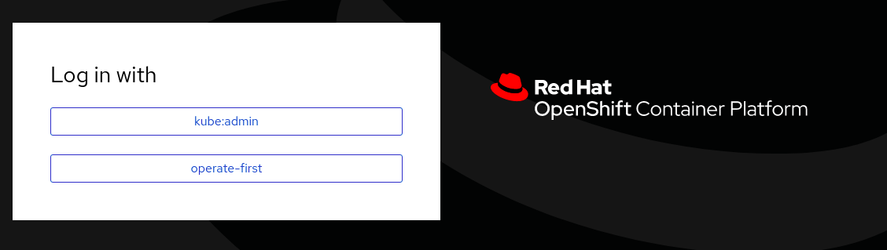
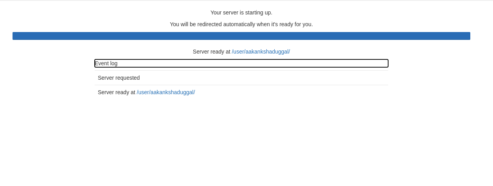
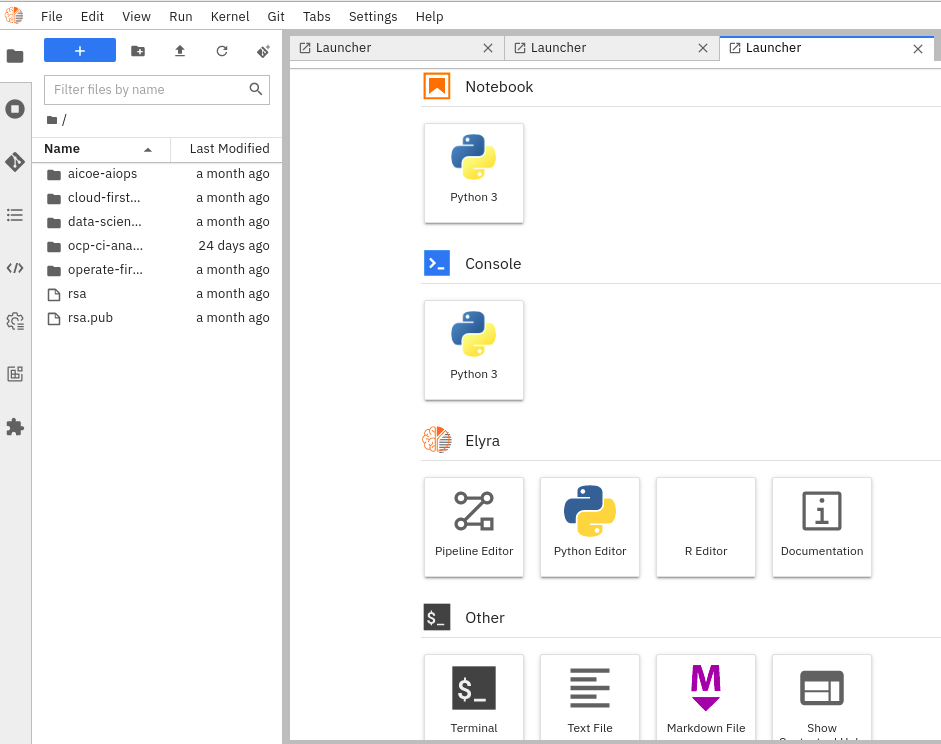
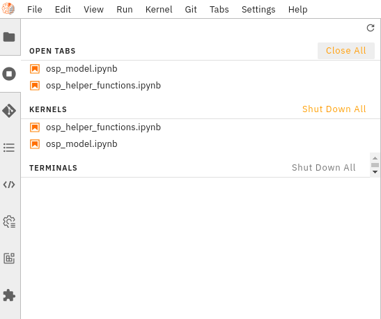

# Deploy Jupyter Lab or Notebooks easily with Operate First

In this guide, we will go over how you can spin up a classic Jupyter Notebook or a Jupyterlab instance to get started with your very own cloud based data science development environment.

* To get started, first go to the [operate-first](https://www.operate-first.cloud/) website and navigate to `Community Handbook` > `GitOps Docs` > `Documentation`. Here you can find info about all the clusters and services managed by the OPF team. 

* To find the resources to access JupyterHub, select `Open Data Hub (ODH)` from the menu on the left  to [Open Data Hub](https://www.operate-first.cloud/apps/content/odh/README.html). Then click on the [UI link]( https://jupyterhub-opf-jupyterhub.apps.smaug.na.operate-first.cloud). 

* This link will redirect you to the login page, where you can choose the `operate-first` login option and you can log in using your Github account.

    

* After successful login, you will be redirected to the jupyterhub spawner page where you can customize the type of jupyter instance you would want to use. This will provide you with a selection of environments, each with some set of pre-installed packages and dependencies, like TensorFlow, Spark, Pandas, etc.

    

* In addition to the image, you can choose the memory and CPU sizes needed for your task,  there are options for small, medium, or large containers. 

    

* Finally, you can set environment variables that can be used to pass specific information, like API credentials, directly into the jupyterhub environment. This allows you to share the notebooks and ensure that no credentials are exposed on GitHub. For example, if your notebook reads data from object storage, you likely don’t want to explicitly put the access key and secret directly into your notebook.  

    

* Once you’ve selected the options that are right for you, go ahead and click “Start server”.

* Starting the instance may take a few seconds, up to a minute. While it’s loading, you can examine the event logs to see what’s going on. One thing to note here is that the jupyter server is connecting to a storage volume, which is like your local hard drive, where your notebooks and other files are stored. So as you log on and off or shut down your server completely, your work persists, even if you start a different notebook image later on - it’s really like your own personal drive.

    

* When you launch your jupyterlab environment for the first time it will be empty. However, the instance here has connected to the storage volume associated with an existing account and so shows some projects that the user has been working on. This page provides a nice user-friendly UI to navigate the notebooks or other files you have in the remote storage. 

    

* Now assuming your directory is completely empty, we can click “+” in the upper left-hand corner, then select from various options like a python3 jupyter notebook from the notebook section, python3 console, elyra and kubeflow pipelines and other features like terminal, text file, markdown file, etc. If you want to access a jupyter notebook, choose the python3 jupyter notebook option and this will spawn a new empty “untitled” notebook for us.

* Now you can start developing. With notebooks, you can toggle cells as either markdown for annotating our work,  display plots, graphs, or images, and write and run python code as we normally would. You’ve got your very own cloud-based data science working environment!  

* You can rename and save the notebook and then shut it down. Once the notebook is closed, you can see that it’s still running on the server based on this green icon next to the file name. 

    

    

* Going to the running tab, we can shut it down completely. 

* You can also use a classic jupyter notebook environment, however, we  typically prefer the jupyter lab environment with its enhanced UI and a larger selection of extensions. Jupyter lab retains all the benefits of the classic notebooks but with a little more flexible and feature-rich UI as well as a whole host of additional extensions to make life easier for data science development.

* When you are ready to sign off it’s best practice to navigate to “File” and find “Hub Control Panel” at the bottom of the dropdown.  This will stop your server and free up the cluster’s resources for other users, but, all your data and work will remain where it is, ready for you to come back later. 

* To monitor your JupyterHub workloads such as CPU, RAM usage, percentage PVC usage, you could use the [grafana dashboards](https://grafana.operate-first.cloud/). To troubleshoot issues while running your notebooks, you can refer to the [Troubleshooting Runbooks.](https://www.operate-first.cloud/apps/content/odh/jupyterhub/runbook.html)

And with that, you now know how to get up and running with your very own jupyterhub environment on the Operate First Cloud. So go ahead, start an instance and have fun!