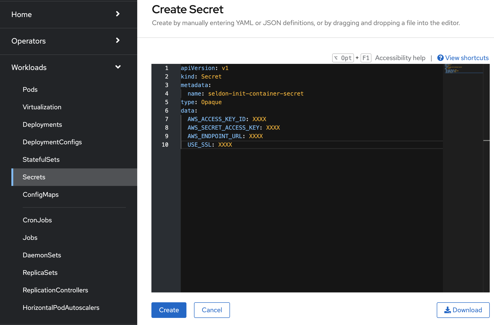
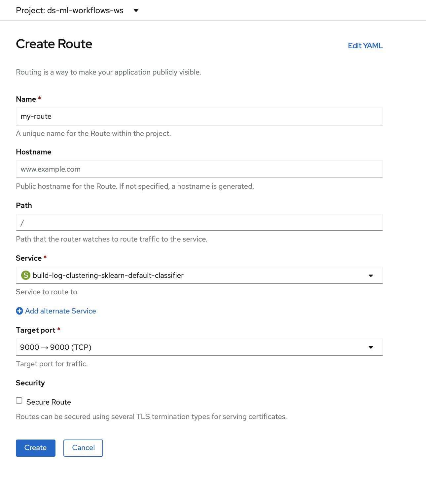

# Deploy models on OpenShift using Seldon Server

Have a model trained and ready to share with the world? In this guide, we go over how to deploy models as a microservice using one of Seldon Core’s pre-packaged [model servers](https://docs.seldon.io/projects/seldon-core/en/v1.1.0/servers/overview.html).

## Pre-requisites

* An ML model trained using one of these supported ML [libraries](https://docs.seldon.io/projects/seldon-core/en/latest/nav/config/servers.html) or a custom model (guide forthcoming) .
* OpenShift namespace with [seldon operator installed](https://docs.seldon.io/projects/seldon-core/en/latest/workflow/install.html#openshift) and administrator privileges available. (If you are using the [Operate First cluster](https://console-openshift-console.apps.zero.massopen.cloud/), you can use the namespace `ds-ml-workflows-ws` which already has Seldon deployed).

## Steps to deploy

1. Save the model as a .joblib file and name it `model.joblib`. Push the model to S3 in its own directory. For example a path like `s3://<bucket_name>/<project_name>/<model_name>/model.joblib`.

2. On the OpenShift console:

    * Ensure the Seldon-Core operator is installed in the namespace where you are deploying.
        * If you are using the [Operate First cluster](https://console-openshift-console.apps.zero.massopen.cloud/), you can use the namespace `ds-ml-workflows-ws` which has Seldon deployed.
        * To get access to this namespace, [open an issue](https://github.com/operate-first/support/issues/new/choose) on the operate-first/support repository.

    * In the namespace, add create a secret with the AWS credentials for access to the bucket. To create a Secret, go to `Workloads`, `Secrets`, click on `Create` and select `From YAML` in the dropdown menu. 
  
    

    Here is an example of the format of the secret:
    ```
    apiVersion: v1
    kind: Secret
    metadata:
    name: seldon-init-container-secret
    type: Opaque
    data:
    AWS_ACCESS_KEY_ID: XXXX
    AWS_SECRET_ACCESS_KEY: XXXX
    AWS_ENDPOINT_URL: XXXX
    USE_SSL: XXXX
    ```
    _Find documentation on how to configure different object storage providers [here](https://docs.seldon.io/projects/seldon-core/en/latest/servers/kfserving-storage-initializer.html)_.

    * First select an “Administrator” profile, then under Operators and Installed Operators you can add new Seldon Deployment in Seldon Core operator by clicking on `Create Instance`.
        * Select `YAML view` and enter your model deployment configuration. [Here](https://github.com/aicoe-aiops/ocp-ci-analysis/blob/master/notebooks/time-to-merge-prediction/seldon-deployment-config.yaml) is an example deployment configuration which uses the Sklearn Server.

        * Find more information on the formats of the deployment configs for other [model servers here](https://docs.seldon.io/projects/seldon-core/en/latest/nav/config/servers.html).
    
    

    * If you are using the SKLearn Seldon server, the `modeluri` refers to the model’s prefix in the Ceph bucket. In your Seldon Deployment, change model URI to be for your model. Sample model URI from S3: `s3://<bucket_name>/<project_name>/<model_name>/model.joblib`
    
    * In your Seldon Deployment, add a reference to the secret with the AWS credentials for access to the bucket like `envSecretRefName: seldon-init-container-secret`, where seldon-init-container-secret is the secret name.
  
    * To test the deployed model endpoint, create a route to the deployed model by selecting the deployed service. To create a route, from the OpenShift console, go to `Networking`, then go to `Routes` and click on “Create Route”. Give the route a desired name, and select the service that we deployed earlier, select a “Target Port” and click on Create.

    

    Once the route has been created, you can send a curl request to interact with the route like:

    `curl -X POST -H 'Content-Type: application/json' -d '{"data": { "ndarray": [[1,2,3,4]]}}' http://localhost:5000/api/v1.0/predictions`

    You can also create a notebook such as [this](https://github.com/aicoe-aiops/ocp-ci-analysis/blob/master/notebooks/time-to-merge-prediction/model_inference.ipynb) to interact with the model and ensure that the service is running as intended.
